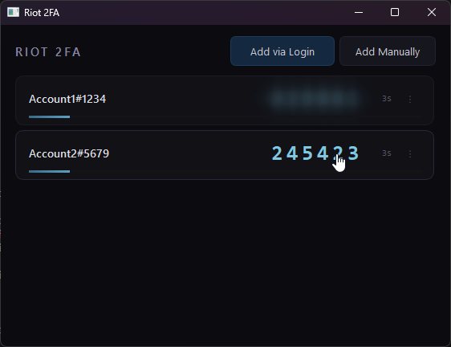

<div align="center">
  <h1 align="center">Riot Games Mobile 2FA Bypass</h1>
  <p align="center">
    Desktop client to manage your own Riot Games mobile 2FA codes directly from your PC.
      <br />
    <br />
    <a href="https://github.com/eschmechel/RiotGames-Mobile-2FA-Bypass/issues">⚠️ Report Bug</a>
    ·
    <a href="https://github.com/eschmechel/RiotGames-Mobile-2FA-Bypass/issues">💡 Request Feature</a>
  </p>
  <p align="center">
    
    
    
  </p>
  <p align="center">
      
  </p>
</div>

---

### 🔍 Overview

`Riot 2FA` is a secure desktop utility that stores and generates TOTP codes for your Riot Games accounts on your desktop instead of using the official mobile 2FA app.

It uses Riot's OAuth login flow to fetch your 2FA secret, encrypts it with AES-256-GCM, and stores it locally. The app requires a password to access your seeds (optional), providing an extra layer of security.

> All account secrets are encrypted at rest with AES-256-GCM and stored in `%appdata%\Riot2FA\accounts.json`

### ⚠️ Important warning

- **You must already have 2FA enabled via email on your Riot account before you use this tool.**
- This tool does not remove, disable, or bypass two-factor authentication; it only gives you another way to see the same codes that your authenticator app would show.
- Only use this tool on accounts you own and control.

### ✨ Features

- **Encrypted storage**: All TOTP seeds encrypted with AES-256-GCM (DEK/KEK model)
- **Optional password protection**: App-level authentication with Argon2id hashing
- **OS secure storage**: Encryption keys stored in Windows Credential Manager via `keyring`
- **Clean desktop UI**: All your Riot accounts and codes in a single window.
- **Add via Login**: Log in once through an embedded browser; the tool automatically extracts your 2FA secret.
- **Add Manually**: Paste the TOTP secret from your Riot 2FA email or QR data.
- **Multiple accounts**: Manage more than one Riot account at the same time.
- **Quick copy**: Click to copy codes to your clipboard.
- **Auto-clear clipboard**: Clipboard automatically clears 30 seconds after copying a code.
- **Audit logging**: All security-relevant events are logged to `%appdata%\Riot2FA\logs\audit.log`

### 🛡️ Security

| Feature | Implementation |
| -------- | -------------- |
| Encryption | AES-256-GCM, 256-bit key, 96-bit nonce |
| Key derivation | PBKDF2-HMAC-SHA256, 1,200,000 iterations |
| Password hashing | Argon2id (RFC 9106) |
| OS key storage | Windows Credential Manager via `keyring` |
| App authentication | Optional password with Argon2id verification |
| Seed access | Re-authentication required to view/copy seeds |

### 🎥 Video Tutorial

To have a full tutorial on how to use: [Click here](https://youtu.be/f1bqPi2Ku9E)

### 🖼️ Screenshot

Main window:


### 🧰 Requirements

- Windows 10 or newer
- Python 3.11+ (only needed if running from source)

---

### 🚀 Installation and usage

#### Option 1 — Download prebuilt release (recommended)

- Go to the [**Releases**](https://github.com/eschmechel/RiotGames-Mobile-2FA-Bypass/releases) section of this project.
- Download the latest `Riot2FA.exe`.
- Run the executable to start the app.

#### Option 2 — Run from source

1. Install Python 3.11+.
2. Clone or download this repository.
3. Open a terminal in the project root and install dependencies:

   ```bash
   pip install -r requirements.txt
   ```

4. Start the application:

   ```bash
   python main.py
   ```

#### Option 3 — Build executable

To build the `.exe` yourself:

```bash
pip install -r requirements.txt
pyinstaller --onefile --windowed --name Riot2FA \
  --hidden-import=keyring.backends.Windows \
  --collect-all keyring \
  main.py
```

The executable will be in `dist/Riot2FA.exe`.

---

### 📖 How to use

1. **First launch**
   - If this is your first time, you'll be prompted to set a password (optional).
   - If you set a password, you'll need to enter it each time you launch the app.
   - You can also enable "Remember me" to store the encryption key in Windows Credential Manager for auto-unlock.

2. **Prepare your Riot account**
   - Make sure 2FA via email is already enabled for your Riot account.
   - Confirm you can receive and approve 2FA emails from Riot before using this tool.

3. **Add an account using "Add via Login"**
   - Open the app and click **Add via Login**.
   - Log in to your Riot account in the embedded browser window.
   - After a successful login, the tool will attempt to enable or attach MFA and fetch the TOTP secret.
   - The account will appear in the list with a live 2FA code and timer.

4. **Add an account manually (optional)**
   - Click **Add Manually**.
   - Enter an account name and your TOTP secret key.
   - Save to start generating codes for that account.

5. **Logging in with a code**
   - When Riot asks to accept on the notification, click on enter a code.
   - Open this tool.
   - Find your account in the list and copy or type the current 6‑digit code into the Riot client.

### 🔧 Settings

- **Reset Password**: Go to Settings > Reset Password to change your app password.
- **Lock Icon**: The lock icon in the header shows your protection status:
  - 🔒 Closed lock: Password protected
  - 🔓 Open lock: No password set (machine-bound encryption only)

### 📊 Data locations

| Data | Location |
|------|----------|
| Encrypted accounts | `%appdata%\Riot2FA\accounts.json` |
| Config (salt, hash) | `%appdata%\Riot2FA\config.json` |
| Audit logs | `%appdata%\Riot2FA\logs\audit.log` |

---

### 🙌 Credits

- **Author**: [Sysy's](https://github.com/Askin242)
- **Current Maintainer**: [Elliott Schmechel](https://github.com/eschmechel)

### 📜 License

This project is licensed under the **MIT License**. See `LICENSE` for details.
